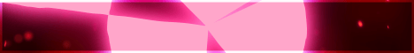

 

<!-- AGE:START -->

<!-- AGE:END -->

---

## 🦇 About Me

Hey, I'm **Darkiyus** — a marketing manager, creative developer and professional collector of overly ambitious ideas.

I started coding in **2019** with **C++**. Since then, I have worked on games, websites, tools, graphics, videos and whatever else manages to catch my attention.

I enjoy projects that combine:

- 🎨 **Creativity** — making things feel distinct instead of generic
- 🧠 **Structure** — turning chaos into clean and usable systems
- 🎮 **Game development** — building worlds, mechanics and experiences
- 🛠️ **Problem-solving** — creating tools that make life easier

My long-term goal is to develop unique games that people can genuinely have fun with.

> My English is still a work in progress — luckily, code speaks every language.

---

## ⚙️ Tech Stack

### Languages & Databases

### Tools & Fields

---

## 🧪 What I Like to Build

<table>
<tr>
<td width="33%" valign="top">

### 🎮 Games

Gameplay systems, mechanics, worlds and experimental game concepts — primarily with Unity and C#.

</td>
<td width="33%" valign="top">

### 🌐 Web Projects

Websites, interfaces, databases and practical tools using HTML, CSS, PHP and MySQL.

</td>
<td width="33%" valign="top">

### 🎨 Creative Stuff

Graphics, videos, concepts and designs that give projects their own visual identity.

</td>
</tr>
</table>

---

## 🚧 Current & Previous Projects

<table>
<tr>
<td width="50%" valign="top">

### Nightmare

An experimental **VRChat all-in-one client/mod**.

The project was discontinued because it no longer provided a meaningful benefit. It remains part of my development journey and taught me a lot about planning, tooling and maintaining larger ideas.

</td>
<td width="50%" valign="top">

### Project ZZZombie

A game project created in **Unity** together with a friend.

A collaborative project focused on combining our ideas, experimenting with gameplay and learning through actually building something.

</td>
</tr>
</table>

---

## 📊 GitHub Activity

 

---

### 🩸 Create. Break. Learn. Rebuild.

*The best projects usually start with an idea that sounds slightly unreasonable.*

